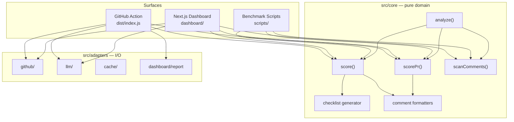
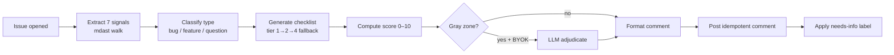
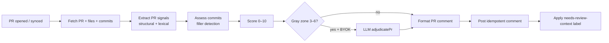
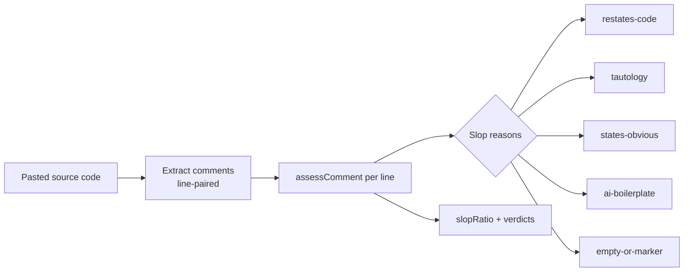
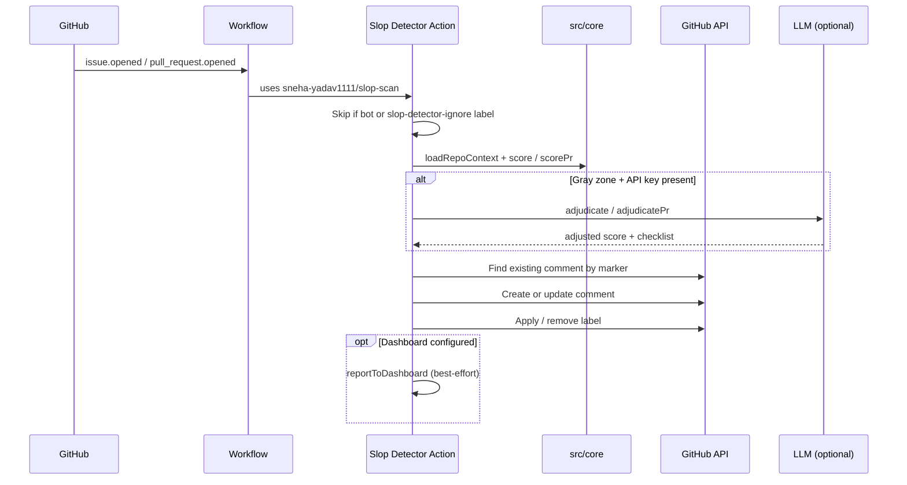
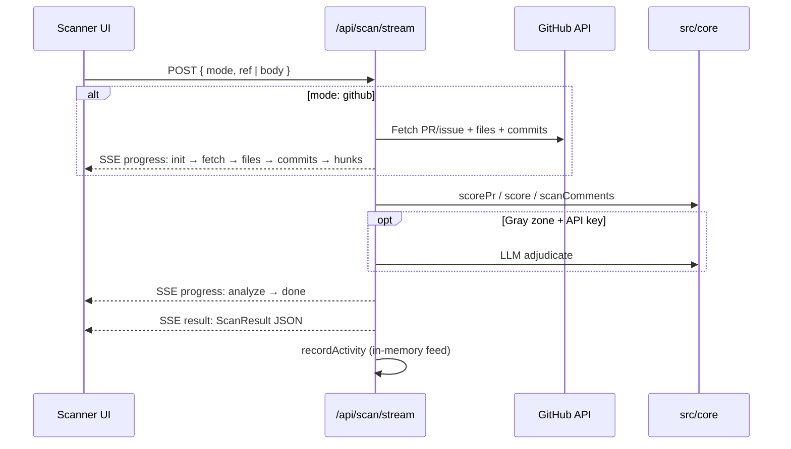
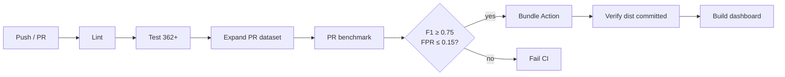

# Slop Detector

**Did a human actually read what the AI wrote before pushing it?**

[](https://slopscan.dev)
[](./LICENSE)
[](./action.yml)
[](#development)

> **Slop Scan hackathon** · [Track A — Code Review](https://slopscan.dev)  
> **Author:** Asteam Black Shadow · **Repository:** [github.com/sneha-yadav1111/slop-scan](https://github.com/sneha-yadav1111/slop-scan)

Slop Detector scores the **information density** of GitHub issues, pull requests, commit messages, and code comments. It surfaces diff-restating filler, hollow commits, and comments that say nothing — regardless of whether AI was involved. It ships as a **GitHub Action** (auto-comments on new issues/PRs) and a **live web dashboard** (paste content or scan a public GitHub URL with real-time SSE progress).

---

## Table of contents

- [The problem](#the-problem)
- [What Slop Detector detects](#what-slop-detector-detects)
- [Key features](#key-features)
- [Architecture](#architecture)
- [Detection pipelines](#detection-pipelines)
- [GitHub Action](#github-action)
- [Web dashboard](#web-dashboard)
- [LLM integration (BYOK)](#llm-integration-bring-your-own-key)
- [Benchmark results](#benchmark-results)
- [Quick start](#quick-start)
- [Configuration](#configuration)
- [Project structure](#project-structure)
- [Development](#development)
- [Deployment](#deployment)
- [Design principles](#design-principles)
- [License](#license)

---

## The problem

Open-source maintainers drown in low-effort reports: PR descriptions that restate the diff, commit messages like `update` or `fix stuff`, and code comments that explain what the next line already says. Generating this content is easy; **catching it before it wastes reviewer time** is not.

Slop Detector answers one question: *Is there enough genuine information here for a maintainer to act?*

```
PR #1284 · "Update files"
Restates the diff without adding context          ┌────────────┐
3/3 commit messages are generic filler            │    70      │  SLOP
Missing: why · testing notes · linked issue       │  /100      │
                                                  └────────────┘
```

---

## What Slop Detector detects

| Artifact | What it checks | Primary signals |
|----------|----------------|-----------------|
| **Pull requests** | Description + commits + review comments | Motivation, testing, issue link, risk vs. diff-restatement, AI boilerplate, thinness |
| **Commit messages** | Each commit in a PR | Generic filler (`update`, `wip`, `address comments`) vs. legitimate mechanical commits |
| **Code comments** | Inline comments vs. annotated code | Restates-the-code, tautology, empty markers, AI docstring boilerplate |
| **Issues** *(supporting)* | Issue body structure | Code block, stack trace, version, repro steps, expected/actual, minimal example |

All four artifact kinds run through **one shared scoring core** — the same functions power the Action, the dashboard, and the benchmark harness.

---

## Key features

| Surface | Capability |
|---------|------------|
| **GitHub Action** | Auto-posts a helpful missing-info checklist on new issues and PRs; idempotent re-runs edit in place |
| **Web dashboard** | Live scanner at `/app` with SSE pipeline progress, slop gauge, evidence breakdown |
| **Live Fire** | Paste a public GitHub PR/issue URL — fetches real diff, commits, and hunks |
| **Heuristics-first** | Deterministic scoring works with **zero API keys**; LLM only for gray-zone cases |
| **Explainability** | Per-signal evidence, score breakdown, and concrete findings — not a black-box score |
| **Cross-track engine** | `analyze()` normalizes PRs, comments, issues, and commits to one 0–100 slop scale |
| **Honest benchmarks** | Published precision/recall with Wilson CIs and documented failure modes |

---

## Architecture

Slop Detector uses **hexagonal architecture**: pure domain logic in `src/core/`, all I/O at the adapter boundary, orchestration in `src/action/` and `dashboard/`.



### Package layout

| Package | Path | Role |
|---------|------|------|
| `slop-detector` | `/` (root) | GitHub Action + shared core + adapters |
| `slop-detector-web` | `dashboard/` | Next.js 15 dashboard |

The dashboard imports the core via TypeScript path aliases (`@core/*`, `@adapters/*`) — **no duplicated scoring logic**.

---

## Detection pipelines

### Issue scoring (supporting)



**Seven binary content signals** (`src/core/heuristics/extractor.ts`):

| Signal | Detects |
|--------|---------|
| `hasCodeBlock` | Fenced code with real content |
| `hasStackTrace` | Multi-frame stack trace |
| `hasVersionMention` | Version / runtime / OS |
| `hasReproKeywords` | Reproduction steps |
| `hasExpectedActual` | Expected vs. actual behavior |
| `hasMinimalExample` | Minimal repro example |
| `hasImageOnly` | Image with no accompanying text *(penalty)* |

**Checklist strategy chain** (`src/core/checklist/generator.ts`):

1. **Tier 1** — Issue forms (`.github/ISSUE_TEMPLATE/*.yml`)
2. **Tier 2** — Markdown templates (`.github/ISSUE_TEMPLATE/*.md`)
3. **Tier 4** — Baseline checklist (always available fallback)

### PR scoring (Track A primary)



**PR description signals** (`src/core/pr/extractor.ts`):

| Positive (information) | Negative (slop) |
|------------------------|-----------------|
| Motivation / why | Diff-restatement |
| Testing notes | Changelog-only boilerplate |
| Linked issue | Generic AI boilerplate |
| Risk / trade-offs | Thin description |
| | Hunk overlap without context |
| | Missing test mention on large diffs |

**Commit slop detection** (`src/core/pr/commits.ts`): flags `update`, `fix stuff`, `wip`, `address comments`, etc., while sparing merges, version bumps, and dependency chores.

### Code comment scanning (Track A)



### Unified cross-track engine

`analyze()` in `src/core/analyze.ts` normalizes all artifact kinds to one scale:

| Signal score (0–10) | Slop score (0–100) | Verdict |
|---------------------|--------------------|---------|
| ≤ 3 | ≥ 70 | **slop** |
| 4–6 | 40–60 | **gray-zone** |
| ≥ 7 | ≤ 30 | **clean** |

Formula: `slopScore = round((10 − signalScore) × 10)`

---

## GitHub Action

### Workflows

| Workflow | Trigger | Permissions |
|----------|---------|-------------|
| [`.github/workflows/triage.yml`](.github/workflows/triage.yml) | `issues: opened, reopened` | `issues: write` |
| [`.github/workflows/pr-triage.yml`](.github/workflows/pr-triage.yml) | `pull_request: opened, synchronize, reopened` | `pull_requests: write` |
| [`.github/workflows/ci.yml`](.github/workflows/ci.yml) | push / PR to main | lint, test, bench, bundle, dashboard build |

### Action lifecycle



### Install in your repo

```yaml
name: Slop Detector Triage

on:
  issues:
    types: [opened, reopened]
  pull_request:
    types: [opened, synchronize, reopened]

permissions:
  contents: read
  issues: write
  pull-requests: write

jobs:
  triage:
    if: github.actor != 'github-actions[bot]'
    runs-on: ubuntu-latest
    steps:
      - uses: actions/checkout@v4   # required for PR triage (repo templates)
      - uses: sneha-yadav1111/slop-scan@main
        with:
          github-token: ${{ secrets.GITHUB_TOKEN }}
        env:
          ANTHROPIC_API_KEY: ${{ secrets.ANTHROPIC_API_KEY }}   # optional BYOK
          OPENAI_API_KEY: ${{ secrets.OPENAI_API_KEY }}         # optional BYOK
```

### Action inputs

| Input | Default | Description |
|-------|---------|-------------|
| `github-token` | `${{ github.token }}` | GitHub API token |
| `dry-run` | `false` | Skip posting comments and labels |
| `enable-comments` | `true` | Post checklist comment |
| `enable-labels` | `true` | Apply/remove triage labels |
| `label-name` | `needs-info` | Issue label when checklist has items |
| `pr-label-name` | `needs-review-context` | PR label when context is missing |
| `model` | *(empty = auto)* | `auto` · `none` · `anthropic:<model>` · `openai:<model>` |
| `max-body-bytes` | `10000` | Truncate issue/PR body before scoring |
| `enable-tier3-llm` | `true` | Tier-3 CONTRIBUTING→LLM strategy (when wired) |

### Opt-out

Add the label **`slop-detector-ignore`** to an issue or PR — the Action exits cleanly without posting.

### Idempotent comments

Every auto-comment includes a hidden HTML marker:

```html
<!-- slop-detector:v1 -->
```

Re-runs **edit the existing comment** instead of spamming new ones (`src/adapters/github/io.ts` paginates all comments to find the marker).

---

## Web dashboard

### Routes

| URL | Purpose |
|-----|---------|
| `/` | Marketing landing page |
| `/app` | **Scanner console** — main demo surface |
| `/how-it-works` | Methodology, detector details, benchmark numbers |

### API endpoints

| Endpoint | Method | Description |
|----------|--------|-------------|
| `/api/scan` | POST | Synchronous scan → JSON result |
| `/api/scan/stream` | POST | **SSE stream** — progress events + final result |
| `/api/activity` | GET | Live activity feed + LLM/GitHub status |
| `/api/ingest` | POST | Action → dashboard feed (token auth) |
| `/api/feedback` | POST | Append feedback to benchmark fixtures |

### SSE scan flow



### Dashboard components

| Component | File | Role |
|-----------|------|------|
| `Scanner` | `dashboard/src/components/Scanner.tsx` | Scan form, SSE pipeline, examples |
| `ResultPanel` | `dashboard/src/components/ResultPanel.tsx` | Verdict, gauge, evidence, checklist |
| `SlopGauge` | `dashboard/src/components/SlopGauge.tsx` | 0–100 circular score |
| `ActivityFeed` | `dashboard/src/components/ActivityFeed.tsx` | Live scan activity sidebar |
| `StatCards` | `dashboard/src/components/StatCards.tsx` | Session stats (total, slop, gray, clean) |
| `SignalChip` | `dashboard/src/components/SignalChip.tsx` | Per-signal positive/negative chips |

---

## LLM integration (bring-your-own-key)

Slop Detector is **heuristics-first**. No LLM is required for a verdict or checklist.

| When | Condition | Function |
|------|-----------|----------|
| Issues | Score in gray zone | `adjudicate()` |
| PRs | Score 3–6 (gray zone) | `adjudicatePr()` |
| Never | Clear slop or clear clean | Heuristic result only |

**Safety rails:**

- **Daily cap:** 50 LLM calls per repo per UTC day (`DailyCapAdapter`)
- **Dedup cache:** SHA256 of title+body on runner — same content won't re-trigger
- **Hero invariant:** any LLM failure returns the unchanged heuristic result — the checklist comment still posts

### Provider priority (auto mode)

| Priority | Provider | Default model |
|----------|----------|---------------|
| 1 | Anthropic | `claude-haiku-4-5` |
| 2 | OpenAI | `gpt-4o-mini` |
| 3 | OpenRouter | `meta-llama/llama-3.3-70b-instruct:free` |
| 4 | Gemini | `gemini-2.0-flash` |

Set `DEMO_MODE=true` for fixture LLM responses without any API key.

---

## Benchmark results

Two evaluations, both using the **exact production detectors** (no separate benchmark scorer).

### Track A — PRs, commits, code comments

Source: [`bench/PR-REPORT.md`](bench/PR-REPORT.md) · Reproduce: `pnpm bench:expand-pr && pnpm bench:pr`

| Metric | Value | 95% Wilson CI |
|--------|-------|---------------|
| **F1** | **0.901** | — |
| Precision | 1.000 | [0.914, 1.000] |
| Recall | 0.820 | [0.692, 0.902] |
| Accuracy | 89.7% | — |
| False-positive rate | **0.0%** | — |

**Dataset:** N = 87 (69 PR/commit, 18 comment blobs) · 13 hand-labeled + 74 programmatic (disclosed in `bench/pr-fixtures/dataset.json` `_meta`)

**Decision rule:** PR/commit slop when score ≤ 3; comments when hollow-ratio > 50%

```
                 Predicted slop    Predicted genuine
Actually slop         41 (TP)            9 (FN)
Actually genuine       0 (FP)           37 (TN)
```

**Known failure mode:** 9 false negatives are borderline slop at score **4/10** (just above the ≤3 threshold).

### Issues — actionability heuristics

Source: [`bench/REPORT.md`](bench/REPORT.md) · Reproduce: `pnpm bench:issues`

| Metric | Value | 95% Wilson CI |
|--------|-------|---------------|
| **F1** | **0.773** | — |
| Precision | 0.660 | [0.566, 0.744] |
| Recall | 0.933 | [0.853, 0.971] |

**Dataset:** 451 historical issues from microsoft/vscode, facebook/react, rust-lang/rust · 70/30 train/test split (seed 42) · ground truth from content oracle, not GitHub labels.

**CI gate:** `scripts/assert-bench-metrics.js --min-f1 0.75 --max-fpr 0.15`

---

## Quick start

### Prerequisites

- **Node.js 24+**
- **pnpm 10+**

### Dashboard (fastest demo)

```bash
git clone https://github.com/sneha-yadav1111/slop-scan.git
cd slop-scan
pnpm install
pnpm demo
```

Open [http://localhost:3000/app](http://localhost:3000/app) — paste a PR or load an example. **No API keys required** for heuristics-only scoring.

### GitHub Action (local)

```bash
cp .env.example .env          # set GITHUB_TOKEN
pnpm package                  # bundle → dist/index.js
pnpm local-action             # run against fixtures/event.json
```

### Optional: enable LLM gray-zone adjudication

```bash
# dashboard/.env.local
ANTHROPIC_API_KEY=sk-ant-...
# or
OPENAI_API_KEY=sk-...
```

---

## Configuration

### Action environment variables

| Variable | Required | Purpose |
|----------|----------|---------|
| `GITHUB_TOKEN` | Yes (local) | GitHub API access |
| `ANTHROPIC_API_KEY` | No | Gray-zone LLM (Anthropic) |
| `OPENAI_API_KEY` | No | Gray-zone LLM (OpenAI) |
| `SLOP_DETECTOR_DASHBOARD_URL` | No | Action → dashboard live feed URL |
| `SLOP_DETECTOR_INGEST_TOKEN` | No | Shared secret for `/api/ingest` |

See [`.env.example`](.env.example) for the full local Action template.

### Dashboard environment variables

| Variable | Required | Purpose |
|----------|----------|---------|
| `GITHUB_TOKEN` | No | Higher rate limits for live URL scans |
| `ANTHROPIC_API_KEY` / `OPENAI_API_KEY` | No | Gray-zone LLM |
| `OPENROUTER_API_KEY` / `GEMINI_API_KEY` | No | Free-tier LLM providers |
| `SLOP_DETECTOR_MODEL` | No | Model override (`auto`, `none`, `anthropic:…`, `openai:…`) |
| `SLOP_DETECTOR_INGEST_TOKEN` | No | Enable `/api/ingest` endpoint |

See [`dashboard/.env.example`](dashboard/.env.example).

---

## Project structure

```
slop-scan/
├── action.yml                 # GitHub Action manifest (Node 24)
├── vercel.json                # Dashboard deploy config
├── package.json               # slop-detector (Action + core)
├── rollup.config.ts           # Bundles Action → dist/index.js
├── pnpm-workspace.yaml        # root + dashboard
│
├── src/
│   ├── action/
│   │   ├── index.ts           # Entry point
│   │   ├── main.ts            # runIssue() · runPullRequest()
│   │   └── summary.ts         # Workflow run UI reports
│   │
│   ├── core/                  # Pure domain (no I/O)
│   │   ├── score-issue.ts     # Issue scoring entry
│   │   ├── analyze.ts         # Unified cross-track engine
│   │   ├── heuristics/        # Issue signal extraction
│   │   ├── pr/                # PR scoring, commits, hunks
│   │   ├── comments/          # Hollow comment detection
│   │   ├── checklist/         # Tiered checklist strategies
│   │   ├── score/             # Weights + compute
│   │   ├── format/            # Comment markdown formatters
│   │   └── llm/               # Adjudication logic (pure)
│   │
│   ├── adapters/              # I/O ports
│   │   ├── github/            # Fetch, post, labels, templates
│   │   ├── llm/               # Anthropic, OpenAI, demo providers
│   │   ├── cache/             # Runner cache + daily cap
│   │   └── dashboard/         # Action → ingest reporter
│   │
│   └── bench/                 # Oracle, replay, metrics
│
├── dashboard/                 # slop-detector-web (Next.js 15)
│   ├── src/app/               # Routes + API
│   ├── src/components/        # UI components
│   └── src/lib/               # scan.ts, github.ts, activity.ts
│
├── bench/
│   ├── REPORT.md              # Issue benchmark report
│   ├── PR-REPORT.md           # Track A bake-off report
│   └── pr-fixtures/           # Labeled PR/comment dataset
│
├── scripts/
│   ├── benchmark.ts           # Issue replay harness
│   ├── pr-benchmark.ts        # Track A bake-off
│   └── assert-bench-metrics.js
│
├── tests/                     # Vitest (362+ tests)
├── dist/index.js              # Bundled Action (committed)
└── .github/workflows/         # CI + triage workflows
```

---

## Development

### Commands

| Command | Description |
|---------|-------------|
| `pnpm install` | Install workspace dependencies |
| `pnpm demo` | Start dashboard at http://localhost:3000 |
| `pnpm test` | Run Vitest suite (362+ tests) |
| `pnpm test:watch` | Vitest watch mode |
| `pnpm lint` | Biome check on `src/` |
| `pnpm format` | Biome format |
| `pnpm package` | Rollup bundle → `dist/index.js` |
| `pnpm all` | format + lint + test + package |
| `pnpm bench:issues` | Issue heuristics benchmark (test split) |
| `pnpm bench:expand-pr && pnpm bench:pr` | Track A bake-off |
| `pnpm local-action` | Run Action locally with `.env` |

### Tech stack

| Layer | Technology | Version |
|-------|------------|---------|
| Runtime | Node.js | 24 (Action `using: node24`) |
| Language | TypeScript | 5.9 |
| Action bundle | Rollup | 4.x |
| GitHub toolkit | `@actions/core`, `@actions/github` | 3.x / 9.x |
| LLM SDKs | `@anthropic-ai/sdk`, `openai` | 0.96 / 6.x |
| Validation | zod | 4.x |
| Markdown AST | unified + remark-parse + remark-gfm | 11.x |
| Issue forms | yaml (eemeli) | 2.x |
| Dashboard | Next.js + React | 15.x / 19.x |
| UI | Tailwind CSS + Radix UI + shadcn/ui | 3.x |
| Test | Vitest | 4.x |
| Lint/format | Biome | 2.x |
| Package manager | pnpm workspaces | 10.x |

### CI pipeline



---

## Deployment

### Vercel (dashboard)

Deploy from the **repository root** — the dashboard imports `../src/core`.

| Setting | Value |
|---------|-------|
| Root Directory | `.` (repo root) |
| Install Command | `pnpm install` |
| Build Command | `pnpm --filter slop-detector-web build` |
| Output Directory | `dashboard/.next` |

Configured in [`vercel.json`](vercel.json).

### GitHub Action (publish)

```bash
pnpm package          # produces dist/index.js
git add dist/index.js
git commit -m "chore: rebuild Action bundle"
git tag v1.0.0
git push origin main --tags
```

Consumers reference: `uses: sneha-yadav1111/slop-scan@v1.0.0`

### Action → dashboard live feed

Set in your workflow:

```yaml
env:
  SLOP_DETECTOR_DASHBOARD_URL: https://your-app.vercel.app
  SLOP_DETECTOR_INGEST_TOKEN: ${{ secrets.SLOP_DETECTOR_INGEST_TOKEN }}
```

And the same `SLOP_DETECTOR_INGEST_TOKEN` in Vercel env vars. This is **best-effort** — it never blocks the hero checklist comment.

---

## Design principles

| Principle | Implementation |
|-----------|----------------|
| **Hero invariant** | The checklist comment must post even if LLM, labels, or dashboard ingest fail |
| **Hexagonal architecture** | Pure `src/core/` — no Octokit, fs, or LLM SDK imports |
| **Single engine** | Action, dashboard, and benchmarks call the same `score()` / `scorePr()` / `scanComments()` |
| **Heuristics-first** | LLM only for gray-zone; works plausibly with zero API keys |
| **Idempotency** | `<!-- slop-detector:v1 -->` marker; edit-in-place on re-runs |
| **Helpful tone** | Comments read as maintainer-friendly guidance, not gatekeeping |
| **Honest benchmarks** | Oracle ground truth for issues; disclosed programmatic expansion for PRs |
| **Bot-loop guard** | Skip when `github.actor` ends with `[bot]` |
| **Opt-out** | `slop-detector-ignore` label |
| **No hosted backend** | BYOK only — no Slop Detector API keys or hosted LLM |

---

## Hackathon context

Built for the **[Slop Scan hackathon](https://slopscan.dev)** (May 29 – Jun 1, 2026) · **Track A — Code Review**.

| Bonus challenge | Evidence |
|-----------------|----------|
| **Bake-Off** | [`bench/PR-REPORT.md`](bench/PR-REPORT.md) — N=87, F1=0.901, Wilson CIs |
| **Live Fire** | Dashboard live GitHub URL scan with SSE pipeline |
| **Cross-Track Scanner** | `analyze()` + unified scan across PR/issue/code/comments |
| **Open Source Ready** | MIT license, CI, `CONTRIBUTING.md`, 362+ tests |

See [`SUBMISSION.md`](SUBMISSION.md) for the full checklist and demo script ([`VIDEO_SCRIPT.md`](VIDEO_SCRIPT.md)).

---

## License

[MIT](./LICENSE) · **Asteam Black Shadow**
