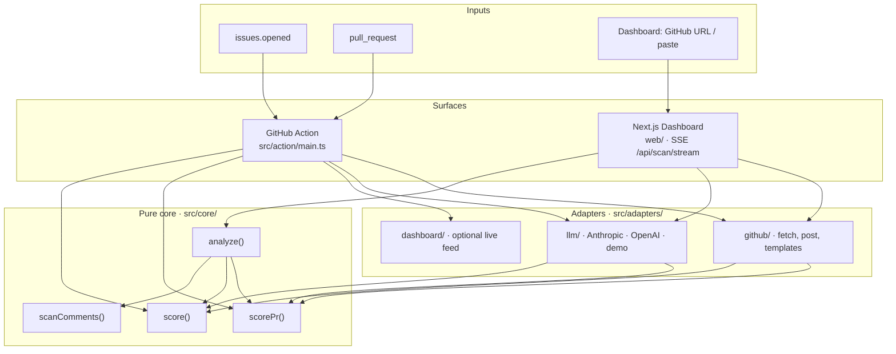
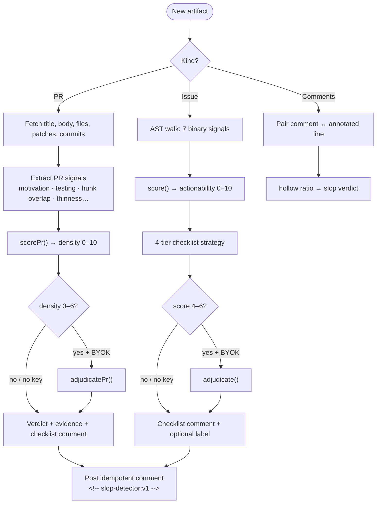
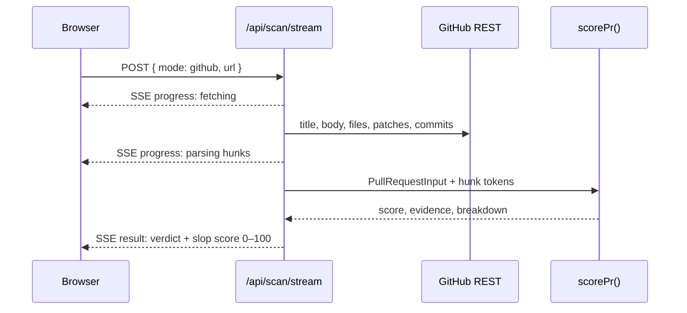
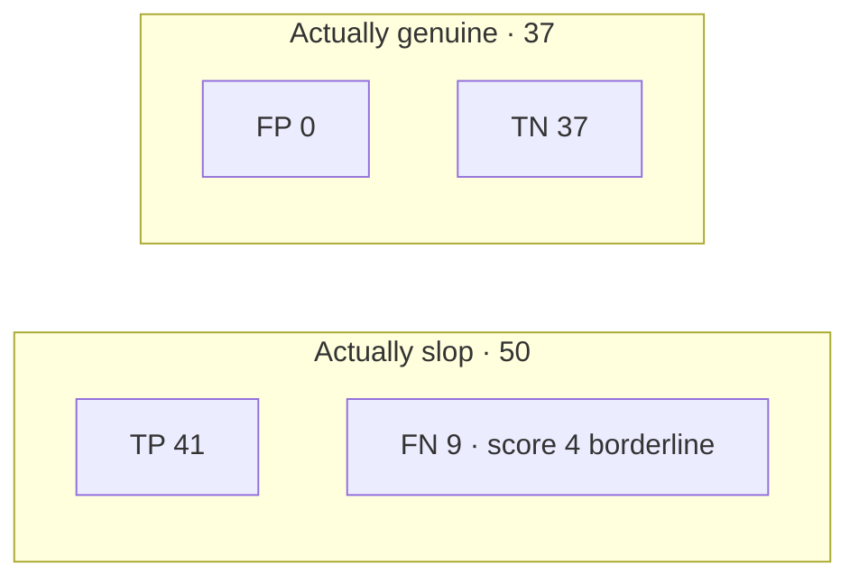

# Slop Detector — Slop Scan · Track A

**Did a human actually read what the AI wrote before pushing it?**

| | |
|---|---|
| **Hackathon** | [Slop Scan](https://slopscan.dev) · **Track A — Code Review** |
| **Author** | Asteam Black Shadow |
| **Repository** | [github.com/sneha-yadav1111/slop-scan](https://github.com/sneha-yadav1111/slop-scan) |
| **Live demo** | Deploy via [Vercel](#deploying-the-dashboard) → open `/app` |
| **Submission checklist** | [`SUBMISSION.md`](SUBMISSION.md) |

Slop Detector scores **information density** in code-review artifacts — not “was this AI?” Hollow PR
descriptions that restate the diff, filler commits (`update`, `wip`), and comments that paraphrase
the next line all get flagged. One shared engine powers a **live dashboard** (paste or GitHub URL)
and a **GitHub Action** (issues + pull requests).

```
PR #1284 · "Update files"                         ┌────────────┐
Restates the diff without adding context          │    100     │  SLOP
3/3 commit messages are generic filler            │  /100      │
Missing: why · testing notes · linked issue       └────────────┘
```

---

## At a glance (for judges)

| Surface | What it does |
|---|---|
| **Dashboard** | Paste or fetch a live GitHub PR/issue; SSE pipeline shows fetch → hunks → analyze; score breakdown + evidence |
| **GitHub Action** | On new issues/PRs: posts idempotent checklist comment; optional label |
| **Benchmarks** | Track A: **F1 0.90**, **0% FPR** on N=87 fixtures · Issues: F1 0.77 on 136 held-out real issues |

**60-second repro:**

```bash
pnpm install && pnpm demo          # http://localhost:3000/app
pnpm test                          # 362+ tests
pnpm bench:expand-pr && pnpm bench:pr   # → bench/PR-REPORT.md
```

**3-minute demo path:** onboarding → **Unified scan** (hollow PR) → **Live Fire** URL (SSE) → **Strong PR** (clean) → open [`bench/PR-REPORT.md`](bench/PR-REPORT.md) for honest false negatives.

---

## System overview

One detection core. Two delivery surfaces. Same scores in the Action, dashboard, and benchmarks.



---

## What it detects (Track A + cross-track)

| Artifact | What we measure |
|---|---|
| **Pull requests** | Motivation, testing, issue-link, risk **vs.** diff-restatement, hunk overlap, changelog-only boilerplate, thinness, test-file / sensitive-path gaps → density **0–10** |
| **Commit messages** | Generic filler vs. mechanical-but-legit merges, version bumps, dependency chores |
| **Code comments** | Restate-the-code / obvious / `This function…` boilerplate **vs.** comments that explain **why** |
| **Issues** *(supporting)* | 7 content signals → actionability score + missing-info checklist |

All four kinds route through `analyze({ kind, ... })` → `UnifiedResult` — the **Cross-Track Scanner** bonus is built in.

---

## Detection pipeline

Heuristics-first. LLM only for gray-zone cases (optional BYOK). We measure **structure and intent**, not em-dash keyword lists.



### Live dashboard scan (SSE)

When you paste a GitHub PR URL, the UI streams progress so judges can watch the real path:



---

## Bake-Off — honest numbers

Both evaluations run the **exact production detectors** — no separate benchmark scorer.

### Track A (primary) — PRs, commits, comments

Regenerate: `pnpm bench:expand-pr && pnpm bench:pr` → [`bench/PR-REPORT.md`](bench/PR-REPORT.md)

| Metric | Value | 95% Wilson CI |
|---|---|---|
| **F1** | **0.901** | — |
| Precision | 1.000 | [0.914, 1.000] |
| Recall | 0.820 | [0.692, 0.902] |
| False-positive rate | **0.0%** | — |
| **N** | **87** | 13 hand-labeled + 74 disclosed expansion |

**Decision rule:** PR/commit slop when score **≤ 3**; comments when hollow ratio **> 50%**.



**Where it fails (say this out loud):** 9 false negatives are programmatic slop templates scoring **4/10** — just above the ≤3 threshold. See [`bench/PR-REPORT.md`](bench/PR-REPORT.md) for IDs.

### Issues (supporting)

Frozen 70/30 split (seed 42) on **microsoft/vscode**, **facebook/react**, **rust-lang/rust**. Ground truth from a content oracle, not GitHub labels. Full methodology: [`bench/REPORT.md`](bench/REPORT.md).

| Metric | Value | 95% Wilson CI |
|---|---|---|
| Precision | 0.660 | [0.566, 0.744] |
| Recall | 0.933 | [0.853, 0.971] |
| F1 | 0.773 | — |
| N (held-out test) | 136 | — |

---

## Bonus challenges

| Bonus | Evidence in this repo |
|---|---|
| **Cross-Track Scanner** | Single `analyze()` engine · PR + commit + comment + issue · Unified scan tab in dashboard |
| **The Bake-Off** | [`bench/PR-REPORT.md`](bench/PR-REPORT.md) + [`bench/REPORT.md`](bench/REPORT.md) · CI gate via `scripts/assert-bench-metrics.js` |
| **Live Fire** | Dashboard live GitHub URL scan · one-click example buttons · SSE pipeline |
| **Open Source Ready** | MIT · [`CONTRIBUTING.md`](CONTRIBUTING.md) · CI: lint, test, bench, bundle, web build |

---

## Honest limitations

- PR bake-off includes **programmatically expanded** fixtures (disclosed in `bench/pr-fixtures/dataset.json` `_meta`); core hand-labeled set is **13** items.
- Borderline slop at score **4/10** passes as “genuine” under the binary ≤3 rule — by design for precision.
- Issue benchmark precision **0.66** — tuned for maintainer recall; questions use a narrower gray band.
- LLM is optional; heuristics-only mode is the default and still posts checklist comments.

---

## Quick start

**Prerequisites:** Node 24+ ([`.nvmrc`](.nvmrc)), pnpm 10+.

```bash
pnpm install
pnpm demo                    # dashboard → http://localhost:3000/app
pnpm test                    # 362+ tests
pnpm bench:expand-pr         # expand fixture set (idempotent)
pnpm bench:pr                # confusion matrix → bench/PR-REPORT.md
pnpm package                 # bundle dist/index.js for Action
pnpm local-action            # run Action locally (.env + fixture)
```

| Command | Purpose |
|---|---|
| `pnpm demo` | Start dashboard |
| `pnpm test` | Vitest (core + adapters + Action) |
| `pnpm bench:pr` | Track-A bake-off → `bench/PR-REPORT.md` + `bench/pr-metrics.json` |
| `pnpm bench:scrape-prs` | Scrape closed PRs (needs `GITHUB_TOKEN`) |
| `pnpm lint` / `pnpm format` | Biome |
| `pnpm --filter slop-detector-web build` | Production dashboard build |

See [`web/README.md`](web/README.md) for API routes and dashboard env vars.

---

## GitHub Action

### Issues

```yaml
name: Slop Detector Issue Triage

on:
  issues:
    types: [opened, reopened]

permissions:
  contents: read
  issues: write

jobs:
  triage:
    runs-on: ubuntu-latest
    if: github.actor != 'github-actions[bot]'
    steps:
      - uses: sneha-yadav1111/slop-scan@v1
        env:
          GITHUB_TOKEN: ${{ secrets.GITHUB_TOKEN }}
          # Optional BYOK for gray-zone adjudication:
          # ANTHROPIC_API_KEY: ${{ secrets.ANTHROPIC_API_KEY }}
```

Zero config → heuristics-only checklist on every new issue.

### Pull requests (Track A)

Included workflow: [`.github/workflows/pr-triage.yml`](.github/workflows/pr-triage.yml)

```yaml
on:
  pull_request:
    types: [opened, synchronize, reopened]

permissions:
  contents: read
  pull-requests: write
```

Posts an **information-density checklist** with the same idempotent marker as issues. Default label: `needs-review-context`.

**Opt-out:** add label `slop-detector-ignore` on an issue.

---

## Configuration

| Input | Default | Description |
|---|---|---|
| `github-token` | `${{ github.token }}` | Read templates, post comments/labels |
| `dry-run` | `false` | Score only; skip comment + labels |
| `enable-comments` | `true` | Skip checklist when `false` |
| `label-name` | `needs-info` | Issue label when checklist has gaps |
| `pr-label-name` | `needs-review-context` | PR label when reviewer context is thin |
| `model` | `''` (auto) | `none` · `anthropic:…` · `openai:…` — see below |
| `gray-zone-low` / `gray-zone-high` | `4` / `6` | Issue LLM band (PR band: 3–6 in core) |
| `max-body-bytes` | `10000` | Issue body truncation (DoS guard) |

**LLM routing (`model` input):** `auto` tries Anthropic then OpenAI from env; `none` disables LLM; failures always fall back to heuristics with the same checklist output.

Copy [`.env.example`](.env.example) for local Action testing.

---

## Scoring reference

### Pull requests (Track A)

[`scorePr()`](src/core/pr/score.ts) → density **0–10** (higher = better). Dashboard slop score = `(10 − density) × 10`.

| Signal | Role |
|---|---|
| `hasMotivation`, `hasTestingNotes`, `hasIssueLink`, `hasRiskNotes` | Reward reviewer-useful prose |
| `isDiffRestating`, `hasHunkOverlap` | Penalize restating paths or diff tokens |
| `isChangelogOnly`, `hasGenericBoilerplate`, `isThin` | Penalize hollow descriptions |
| `missingTestsMention`, `requiresRiskNotes` | Test/sensitive paths without context |

Live scans parse patches into hunk tokens. Output includes `evidence`, `scoreBreakdown`, `diffOverlapPercent`.

### Issues (supporting)

7 weighted signals ([`src/core/score/weights.ts`](src/core/score/weights.ts)) + 4-tier checklist (issue forms → md templates → CONTRIBUTING LLM → baseline).

---

## Safety & resilience

- **Hero output never blocks** — checklist posts before labels; LLM/summary failures can't suppress it
- **No bot loops** — skip `[bot]` actors; separate issue/PR workflows
- **Least privilege** — no `pull_request_target`
- **Idempotent comments** — `<!-- slop-detector:v1 -->` marker; re-runs edit in place
- **Prompt-injection hardening** — sanitize + truncate before LLM
- **Daily LLM cap** — per-repo budget on runner; transparent heuristic fallback

---

## Deploying the dashboard

Monorepo deploy — dashboard imports `../src/core`.

**Recommended (root [`vercel.json`](vercel.json)):**

| Setting | Value |
|---|---|
| Root Directory | `.` (repo root) |
| Install | `pnpm install` |
| Build | `pnpm --filter slop-detector-web build` |
| Output | `web/.next` |

Optional env: `GITHUB_TOKEN`, `ANTHROPIC_API_KEY` / `OPENAI_API_KEY`, `SLOP_DETECTOR_INGEST_TOKEN`.

**Action → dashboard live feed** (best-effort, never blocks comments):

```yaml
env:
  SLOP_DETECTOR_DASHBOARD_URL: https://your-app.vercel.app
  SLOP_DETECTOR_INGEST_TOKEN: ${{ secrets.SLOP_DETECTOR_INGEST_TOKEN }}
```

---

## Architecture

| Layer | Role |
|---|---|
| `src/core/` | Pure detectors — `score()`, `scorePr()`, `scanComments()`, `analyze()` |
| `src/adapters/github/` | `fetchPullRequest`, `map-pr`, post comment, templates, labels |
| `src/adapters/llm/` | Anthropic / OpenAI / demo + PR adjudication |
| `src/action/main.ts` | `runIssue()` · `runPullRequest()` |
| `web/` | Next.js 15 · SSE scan · explainability UI · activity feed |
| `scripts/` | `pr-benchmark.ts`, `expand-pr-dataset.ts`, `benchmark.ts` |

**Toolchain:** Node 24 · TypeScript 5.9 · pnpm workspace · Rollup 4 · Vitest 4 · Biome 2 · Next.js 15 · shadcn/ui

---

## License

[MIT](./LICENSE) · Asteam Black Shadow
